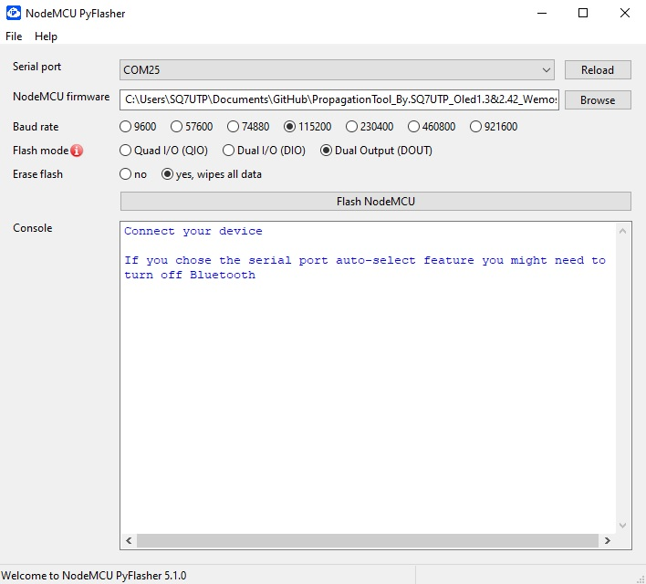
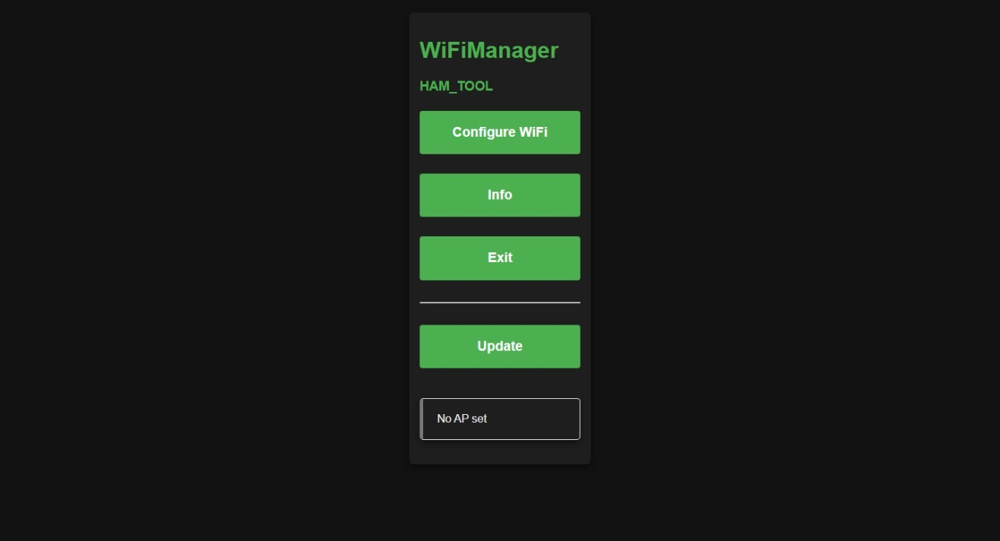
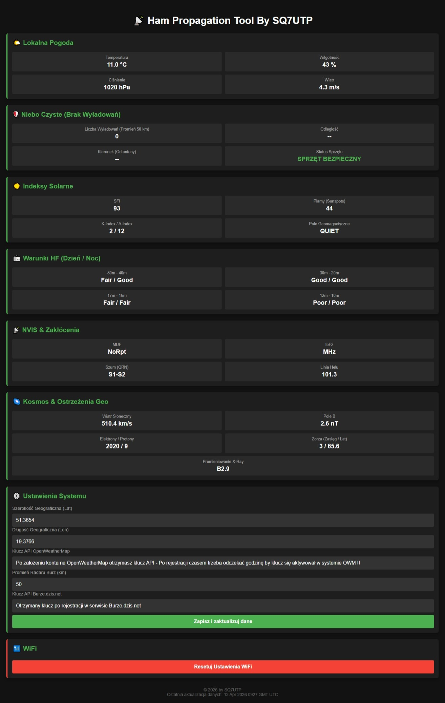
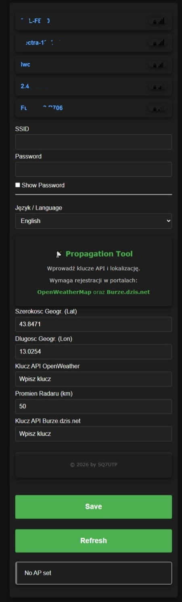

# Ham Propagation Tool By SQ7UTP 📡 (Wemos D1 Mini + OLED)

  

**Ham Propagation Tool** to zaawansowana stacja monitorująca warunki radiowe, pogodę oraz wyładowania atmosferyczne, dedykowana dla krótkofalowców. Urządzenie zostało zaprojektowane tak, aby w estetyczny sposób prezentować kluczowe dane z wielu niezależnych serwisów (HamQSL, OpenWeatherMap, Burze.dzis.net) na wyświetlaczach OLED.

**Autor:** Marcin "Skrętka" (SQ7UTP)
📧 **Kontakt:** sq7utp@gmail.com

---

## ⚡ Szybkie Pobieranie (Direct Downloads)
Wgraj gotowe oprogramowanie bez konieczności kompilacji kodu:

* 📥 **[Pobierz Firmware dla OLED 2.42" (SPI)](firmware/Prop_Tool_by.SQ7UTP_Oled2.42.bin)**
* 📥 **[Pobierz Firmware dla OLED 1.3" (I2C)](firmware/Prop_Tool_by.SQ7UTP_Oled1.3.bin)**
* 🛠️ **[Pobierz Narzędzie Flashujące (NodeMCU PyFlasher)](tools/NodeMCU-PyFlasher.rar)**

---

## 🌟 Główne Funkcje Systemu

* **Monitoring Propagacji:** Pełne dane SFI, Sunspots, A/K-Index oraz stan pasm HF (Dzień/Noc).
* **Radar Burzowy (Real-Time):** Integracja z systemem Burze.dzis.net. W przypadku wykrycia wyładowań, system przechodzi w tryb alarmowy (miganie ekranu, dane o dystansie i kierunku).
* **Lokalna Pogoda:** Aktualne dane meteo z serwisu OpenWeatherMap.
* **Web Dashboard:** Nowoczesny, ciemny panel sterowania dostępny pod adresem IP urządzenia w sieci lokalnej.
* **Aktualizacje OTA:** Urządzenie potrafi samodzielnie pobrać nowszą wersję softu bezpośrednio z tego repozytorium GitHub.
* **WiFi Manager:** Prosta konfiguracja przy pierwszym uruchomieniu przez telefon.

---

## 🛠️ Montaż i Schemat Połączeń

Projekt wspiera dwa typy wyświetlaczy. Wybierz schemat zgodny z posiadanym ekranem:

### 1. Ekran 2.42" OLED (SSD1309) - Połączenie SPI
| Pin Wyświetlacza | Wemos D1 Mini | Funkcja |
| :--- | :--- | :--- |
| **GND** | GND | Masa |
| **VCC** | 3.3V | Zasilanie |
| **SCL / D0** | **D5** (GPIO 14) | Zegar (Clock) |
| **SDA / D1** | **D7** (GPIO 13) | Dane (MOSI) |
| **RES** | **D0** (GPIO 16) | Reset |
| **DC** | **D6** (GPIO 12) | Sterowanie danymi |
| **CS** | **D8** (GPIO 15) | Wybór układu |

### 2. Ekran 1.3" OLED (SH1106) - Połączenie I2C
| Pin Wyświetlacza | Wemos D1 Mini | Funkcja |
| :--- | :--- | :--- |
| **VCC** | 3.3V | Zasilanie |
| **GND** | GND | Masa |
| **SCL** | **D1** (GPIO 5) | Zegar I2C |
| **SDA** | **D2** (GPIO 4) | Dane I2C |

---

## 🚀 Instalacja Oprogramowania (BIN)

Użyj dołączonego narzędzia **NodeMCU PyFlasher**:

1. Podłącz Wemos D1 Mini do komputera.
2. Uruchom `NodeMCU-PyFlasher.exe`.
3. Wybierz odpowiedni port COM.
4. Wybierz pobrany plik `.bin` (zależnie od ekranu).
5. Ustawienia: `Baud rate: 115200`, `Flash mode: DOUT`, `Erase flash: yes (przy pierwszej instalacji)`.
6. Kliknij **Flash NodeMCU**.

  

---

## ⚙️ Pierwsze Uruchomienie i Konfiguracja

1. Po wgraniu softu, na ekranie zobaczysz napis **BRAK SIECI**.
2. Na telefonie połącz się z siecią WiFi o nazwie **HAM_TOOL**.
3. Powinna otworzyć się strona konfiguracyjna (jeśli nie, wejdź na `192.168.4.1`).
4. Wybierz swoją sieć WiFi i wpisz hasło.
5. Podaj klucze API oraz współrzędne (Lat/Lon). Zapisz - urządzenie zrestartuje się.

### 🔑 Uzyskiwanie kluczy API (Ważne!)
Do poprawnego działania stacji niezbędne jest posiadanie własnych kluczy API. Rejestracja w obu serwisach jest darmowa dla użytkowników indywidualnych:
* **OpenWeatherMap:** Załóż konto na [openweathermap.org](https://openweathermap.org/), aby uzyskać klucz do danych pogodowych.
* **Burze.dzis.net:** Zarejestruj się na [burze.dzis.net/api.php](https://burze.dzis.net/api.php), aby otrzymać klucz API do obsługi radaru.

**UWAGA:** Po wygenerowaniu nowego klucza API w powyższych serwisach, należy **odczekać około 1 godziny**, zanim klucz stanie się aktywny w ich systemach. Jeśli stacja wyświetla błąd autoryzacji tuż po konfiguracji, poczekaj cierpliwie – jest to wymóg serwerów dostawców danych, a nie błąd programu.

  
  

---

## 🖥️ Przegląd Interfejsu (Ekrany)

### Pomiary i Dane:

  
  
  

  
  
  

  
  
  

### Radar Burzowy (Tryby):

  
  

---

## 🌐 Web Panel (Zarządzanie przez WWW)

Wpisz adres IP urządzenia w przeglądarce, aby uzyskać dostęp do panelu. Pozwala on na zmianę kluczy API oraz zdalny reset WiFi.

  
  
  

---

## 🔄 Aktualizacje OTA

System automatycznie sprawdza nowsze wersje na GitHub. Jeśli wersja w repozytorium jest wyższa niż w urządzeniu, zobaczysz monit o aktualizacji.

  
  

---

## 🖨️ Obudowa (Druk 3D)

* 📥 **[Obudowa dla wersji OLED 1.3" (Printables)](https://www.printables.com/model/160473-terminal-for-ssd1306-13-oled-and-wemos-d1-mini-new)**
* 📥 **[Obudowa dla wersji OLED 2.42" (Printables)](https://www.printables.com/model/441957-242in-oled-case-with-optional-platform)**

---

## 📜 Licencje i Odpowiedzialność

1.  **Kod źródłowy:** Licencja `GPL-3.0`.
2.  **Model obudowy:** Licencja `CC BY-NC 4.0` (użytek własny).

⚠️ **OSTRZEŻENIE:**
Instalacja oprogramowania oraz wszelkie modyfikacje sprzętowe wykonywane są **na własną odpowiedzialność użytkownika**. Autor nie ponosi odpowiedzialności za uszkodzenia sprzętu ani za skutki błędnych odczytów danych meteo/burzowych. Radar burzowy opiera się na danych zewnętrznych i nie powinien być jedynym źródłem bezpieczeństwa dla Twojego shacku!

---
*73! de SQ7UTP*
